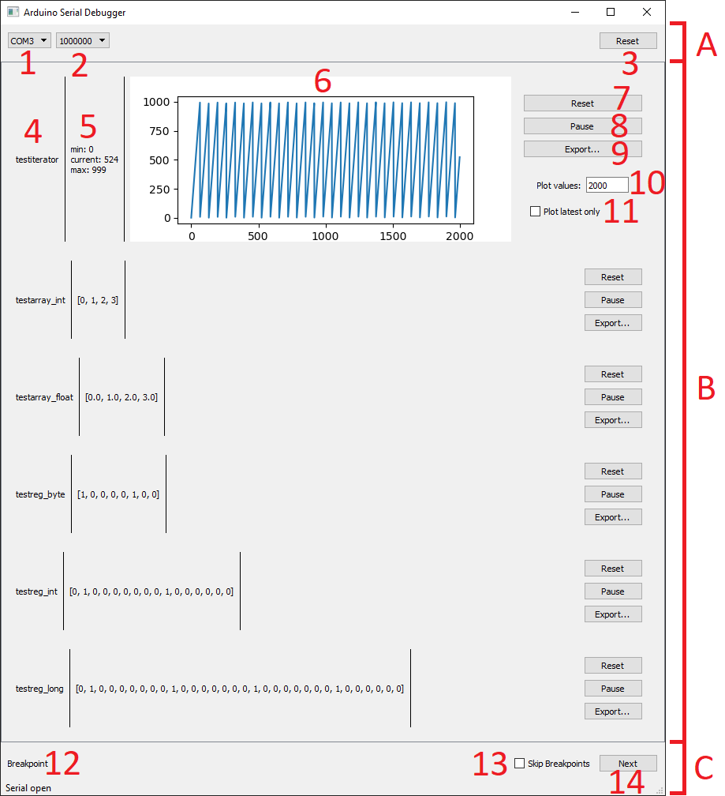

# Arduino Serial Debugger

## Overview
Small library for Arduino debugging over serial port. Features:

- breakpoints: halt execution until "ok" is received over serial.
- logging: logging of simple strings, variables and arrays

SerialDebugger.ino contains sample usage.

gui/SerialDebuggerInterface.py contains a QT GUI to visualize logged variables and skip over breakpoints. 

## GUI

The GUI is designed to log and show variables and to skip over breakpoints.

- A: Serial configuration
    - 1: Select port
    - 2: Baud rate
    - 3: Reset all variables
- B: Variable logging
    - 4: Variable name as set in logging API
    - 5: Current variable values. Min and Max are only enabled on single value variables
    - 6: Simple plot. Only enabled on single value variables
    - 7: Reset all logged values of current variable
    - 8: Pause logging for specific variable
    - 9: Export values as comma seperated values file (.csv)
    - 10: Number of values in plot
    - 11: Switch all/only latest values plotting
- C: Breakpoint handling
    - 12: Name of current breakpoint as defined in breakpoint API
    - 13: Automaticly send "ok" message
    - 14: Skip over current breakpoint

## Performance

Depending on baud rate variable logging takes up to:
- 37 ms on 9600 baud
- 17 ms on 19200 baud
- 7 ms on 38400 baud
- 3.5 ms on 57600 baud
- 2.2 ms on 74880 baud
- 870 us on 115200 baud
- 840 us on 230400 baud
- 860 us on 250000 baud
- 980 us on 500000 baud
- 900 us on 1000000 baud
- 760 us on 2000000 baud